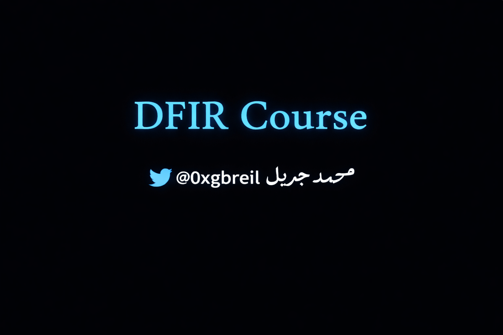

# DFIR-Course-Arabic

Arabic DFIR course covering Digital Forensics & Incident Response with practical labs, slides, and hands-on examples for beginners and security enthusiasts.

---

Course Link -> https://youtube.com/playlist?list=PL6cHkEIFQYE_io0kcLtWwdOYv0WfpwTHA&si=pEvE5gmRLS5G_gAz

## 🎥 My YouTube Channel
https://www.youtube.com/@0xgbreil

---

---

## 📬 Contact

- LinkedIn → https://www.linkedin.com/in/0xgbreil/
- X (Twitter) → https://x.com/0xgbreil
- Blog → https://medium.com/@0xgbreil
